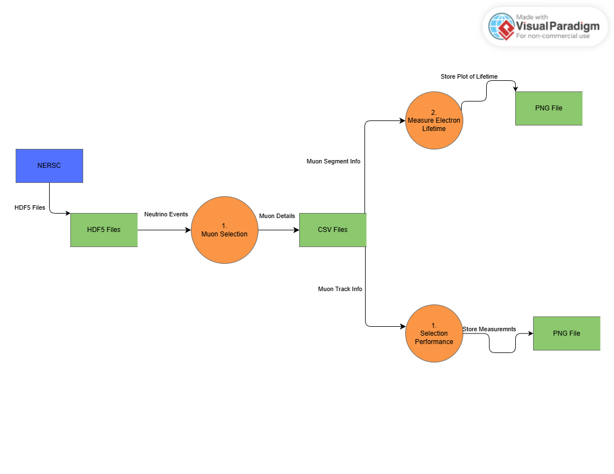

# Repository Overview

This repository serves as the code database for the muon selection for the Deep Underground Neutrino Experiment's ND-LAr prototype, the 2x2. This repository will teach you how to install all the dependencies and how to run the muon selection. <br>

The muon selection has 3 parts which are selecting the muon tracks in the 2x2, calculating the purity and the efficiency, and extracting the electron lifetime. The git repository will come with a data file in the data directory, so you are able to run the selection workflow. If you would like more data files you can wget them from [NERSC](https://portal.nersc.gov/project/dune/data/2x2/simulation/productions/MiniRun6_1E19_RHC/MiniRun6_1E19_RHC.flow/FLOW/0000000/). Below is a Data Flow Diagram, showing the data storages, processes, and outputs of the selection. <br>



------

## How-To-Run
Running the selection hopefully should be quick smooth..... considering that everything works properly. The only dependecy you should need to install is snakemake and conda. <br> 
First, git clone this repository to your local machine with either or the commands below.<br>

For SSH: ```git clone git@github.com:Rossd437/project-CMSE-602.git``` <br>
For HTTPS: ```git clone https://github.com/Rossd437/project-CMSE-602.git``` <br>

Make sure your change into the correct directory with: <br>
```cd project-CMSE-602```

Now we can start on the conda environment. There is a script in the `scripts` directory ready to be run that will install all the dependecies for you. Switch to the scripts directory with: <br>

`cd scripts`

You may need to change the permission to be able to execute the script by running: <br>

`chmod 700 install_env.sh`

Then run: <br>

`source install_env.sh`

This will install all the dependencies from conda, such as, python, pip, snakemake, numpy, pandas, matplotlib, scipy, sccikit-learn, and seaborn. It will then activate the conda environment that it just made. After activating the conda environment, it still needs to pip install pylandau and h5flow. After it installs those last two dependencies with pip, your conda environemnt is now setup and activated for you and you will automatically `cd` back to `project-CMSE-602`. 

Now that you have your conda environment, running should go smooth..... hopefully. Since you should already be in the `project-CMSE-602` directory, just run: <br>

```snakemake --use-conda --cores 1```

AAAANNNNND finished!!! There should be plots of the purity, efficiency, and lifetime of the muon selection in a ```results/plots``` directory. Also, there should be two csv files of the track and segment information in ```results/csvs```.

-----

## How To Obtain Track and Segment Information

After you ran the selection, there will be two csv files in the `results/csvs` directory. If you would like to read through these csv files, pandas is the recommended option. You can install pandas in a python virtual environment or conda environment with the commands below. <br>

Python Virtual Environment: `pip install pandas` <br>
Conda Environment: `conda install conda-forge::pandas` <br>

To load in the csv files,

Load in csv file: `df = pd.read_csv(<file_name>)`

If you would like to now what values are stored in the csv file:

Csv columns: `df.columns`

You can do all kinds of data analysis with these dataframes for examples:

Segment dQ/dx: `df['dQ']/df['dx']`
Segment dN/dx: `df['dQ']/df['dx']`

and so on. Pretty much just do `df['<column_name>']`.
